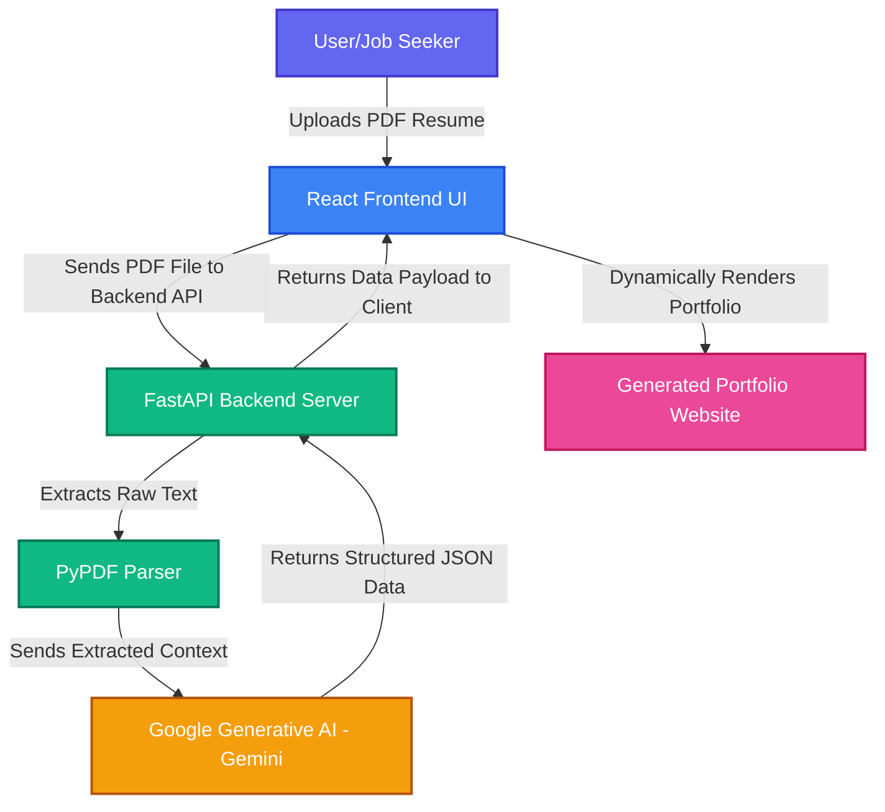

# Resume to Portfolio 🚀

Transform your static resume into a stunning, dynamic, and interactive online portfolio. Powered by the magic of Generative AI!

## 🌟 Overview
**Resume to Portfolio** is an intelligent web application designed to help job seekers stand out. Simply upload your standard PDF resume, and watch as our application seamlessly parses, analyzes, and converts your professional experience into a beautiful, personalized, and fully functional portfolio website—all tailored to highlight your unique skills and achievements.

## ✨ Features
- **Effortless Upload**: Drag and drop your PDF resume.
- **AI-Powered Analysis**: Leverages Google Generative AI to intelligently extract and format your professional data.
- **Instant Generation**: Creates a beautiful, dynamic React-based UI reflecting your career history, skills, and projects.
- **Responsive Design**: Looks perfectly polished on desktops, tablets, and mobile devices.

## 🏗️ System Architecture

The application uses a robust and modern architecture to quickly process and render your portfolio!



## 🛠️ Technologies Used
The project is built on a modern, decoupled tech stack:

### Frontend
- **React 19** - For building rich and interactive user interfaces.
- **Vite** - Next-generation frontend tooling for blistering fast development.
- **Tailwind CSS** - A utility-first CSS framework for rapid UI development.
- **Lucide React** - Beautiful and consistent icons.

### Backend
- **FastAPI** - A modern, fast (high-performance) web framework for building APIs with Python 3.12+.
- **Google Generative AI (Gemini)** - Cutting-edge LLM used for intelligent data extraction and content creation.
- **PyPDF** - Powerful PDF processing tool for text extraction.
- **Uvicorn** - Lightning-fast ASGI web server implementation.

## 🚀 Getting Started

To get started with development, you'll need two terminal windows to run both the frontend and backend servers.

**Frontend Setup:**
```bash
cd frontend
npm install
npm run dev
```

**Backend Setup:**
```bash
cd backend
# Install dependencies and sync the environment
uv sync
# Run the FastAPI application
uv run uvicorn app.main:app --reload
```

## 🏅 Created By
**Inbal Geva Oren**. 

---
*If you like this project, consider giving it a ⭐!*
